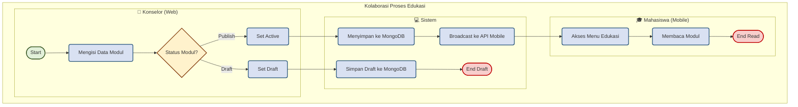
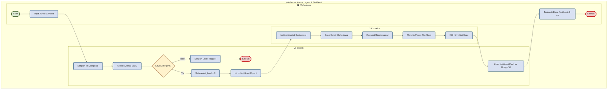
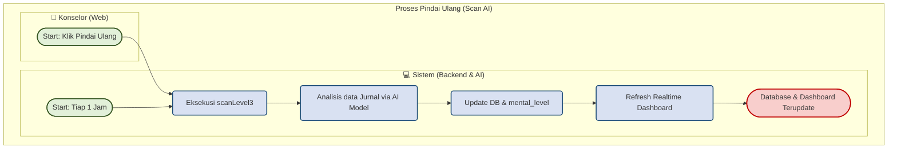
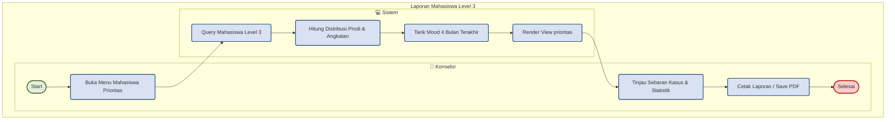
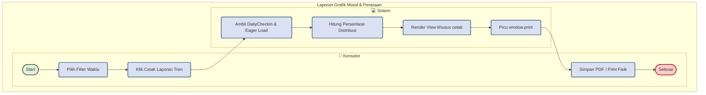
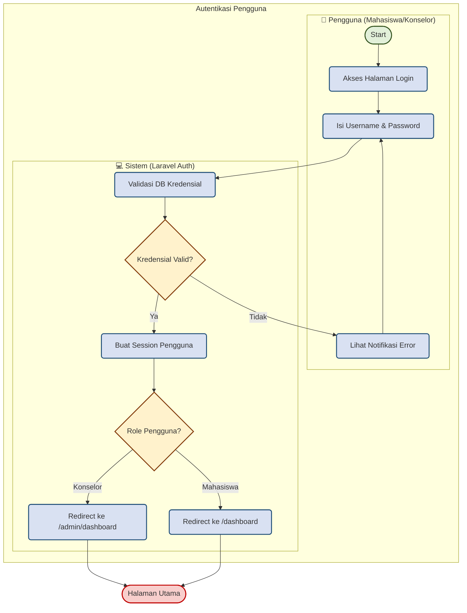

# BPMN Diagrams - Sistem Monitoring Kesehatan Mental Mahasiswa (TA-KEL-12)

Dokumen ini menyediakan diagram **BPMN (Business Process Model and Notation)** lengkap untuk seluruh proses utama di bawah tanggung jawab Anda pada proyek monitoring ini.

Dokumen ini disajikan dalam dua format:
1. **Visual Mermaid (Bizagi Style)**: Dapat dipreview langsung di VS Code. Warna dimodelkan agar mirip dengan Bizagi Modeler default (Start = Hijau, Task = Biru, Gateway = Kuning, End = Merah).
2. **File XML BPMN 2.0 Standar**: Tersedia dalam file standalone berekstensi `.bpmn` di folder `docs/` yang sudah dilengkapi dengan data koordinat visual (`BPMNDiagram` layout). Ini menjamin **Bizagi Modeler (termasuk versi 4.3)** dapat membukanya secara instan tanpa mengalami *infinite loading/freeze*.

---

## Daftar File BPMN Standar (Siap Import ke Bizagi)
* **[docs/bpmn_edukasi.bpmn](file:///e:/kuliah/PA3/TA-KEL-12/docs/bpmn_edukasi.bpmn)**: Alur Pengelolaan & Penggunaan Modul Edukasi.
* **[docs/bpmn_laporan.bpmn](file:///e:/kuliah/PA3/TA-KEL-12/docs/bpmn_laporan.bpmn)**: Alur Penanganan Kasus Urgent & Notifikasi Peringatan.
* **[docs/bpmn_scan_notifikasi.bpmn](file:///e:/kuliah/PA3/TA-KEL-12/docs/bpmn_scan_notifikasi.bpmn)**: Alur Pindai Ulang (Scan AI) - Manual & Otomatis.
* **[docs/bpmn_kirim_notifikasi.bpmn](file:///e:/kuliah/PA3/TA-KEL-12/docs/bpmn_kirim_notifikasi.bpmn)**: Alur Pengiriman Notifikasi Kustom ke Mahasiswa.
* **[docs/bpmn_laporan_l3.bpmn](file:///e:/kuliah/PA3/TA-KEL-12/docs/bpmn_laporan_l3.bpmn)**: Alur Generate Laporan Mahasiswa Level 3 (Kasus Urgent).
* **[docs/bpmn_laporan_grafik.bpmn](file:///e:/kuliah/PA3/TA-KEL-12/docs/bpmn_laporan_grafik.bpmn)**: Alur Generate Laporan Grafik Mood & Perasaan.
* **[docs/bpmn_koreksi_ai.bpmn](file:///e:/kuliah/PA3/TA-KEL-12/docs/bpmn_koreksi_ai.bpmn)**: Alur Mengubah & Mengoreksi Label Klasifikasi AI.
* **[docs/bpmn_login.bpmn](file:///e:/kuliah/PA3/TA-KEL-12/docs/bpmn_login.bpmn)**: Alur Autentikasi Pengguna (Login).

---

## 1. Alur Pengelolaan & Penggunaan Modul Edukasi
Proses pembuatan modul edukasi oleh Konselor melalui dashboard web admin hingga dibaca oleh Mahasiswa di aplikasi mobile.



---

## 2. Alur Penanganan Kasus Urgent & Notifikasi Peringatan
Proses deteksi dini krisis mental mahasiswa lewat analisis sentimen jurnal harian (AI) hingga pengiriman notifikasi peringatan kustom langsung oleh Konselor ke perangkat Mahasiswa.



---

## 3. Alur Pindai Ulang (Scan AI) - Manual & Otomatis
Proses memindai ulang kondisi mental seluruh mahasiswa menggunakan model AI. Proses ini dapat dipicu secara manual oleh Konselor dari Dashboard, atau berjalan secara otomatis setiap jam melalui Laravel Scheduler (cron job).



---

## 4. Alur Pengiriman Notifikasi Kustom ke Mahasiswa
Proses Konselor mengirimkan pesan intervensi/peringatan kustom secara manual ke mahasiswa tertentu dari Halaman Detail Mahasiswa.

```mermaid
flowchart TD
    classDef startEvent fill:#E2F0D9,stroke:#385723,stroke-width:2px,rx:20px,ry:20px;
    classDef task fill:#D9E1F2,stroke:#1F4E78,stroke-width:2px,rx:5px,ry:5px;
    classDef endEvent fill:#F8CECC,stroke:#C00000,stroke-width:2px,rx:20px,ry:20px;
    
    subgraph PoolKirimNotif ["Pengiriman Notifikasi Kustom"]
        subgraph LaneKonselorN ["👤 Konselor"]
            direction LR
            S4_N([Start]) --> T26[Buka Detail Profil Mahasiswa] --> T27[Tulis Pesan Notifikasi] --> T28[Klik Kirim Pesan]
        end
        subgraph LaneSistemN ["💻 Sistem (Laravel)"]
            direction LR
            T29[Simpan Notifikasi ke MongoDB]
        end
        subgraph LaneMhsN ["🎓 Mahasiswa"]
            direction LR
            T30[Terima Notifikasi di HP] --> T31[Membuka & Membaca Notifikasi] --> E6_N([Pesan Diterima])
        end
    end
    T28 --> T29
    T29 --> T30
    class S4_N startEvent; class T26,T27,T28,T29,T30,T31 task; class E6_N endEvent;
```



---

## 5. Alur Generate Laporan Mahasiswa Level 3
Proses mengekstrak, menghitung statistik, dan menyajikan visualisasi data khusus untuk seluruh mahasiswa krisis (Level 3) pada menu prioritas.



---

## 6. Alur Generate Laporan Grafik Mood & Perasaan
Proses mengekspor diagram perkembangan emosional kolektif mingguan dan bulanan ke dalam dokumen cetak resmi.



---

## 7. Alur Mengubah & Mengoreksi Label Klasifikasi AI
Proses Konselor membatalkan (*override*) label tingkat depresi/kecemasan yang dihasilkan AI karena hasil klasifikasi keliru atau kondisi mahasiswa telah membaik secara manual.

```mermaid
flowchart TD
    classDef startEvent fill:#E2F0D9,stroke:#385723,stroke-width:2px,rx:20px,ry:20px;
    classDef task fill:#D9E1F2,stroke:#1F4E78,stroke-width:2px,rx:5px,ry:5px;
    classDef endEvent fill:#F8CECC,stroke:#C00000,stroke-width:2px,rx:20px,ry:20px;
    
    subgraph PoolKoreksi ["Koreksi Label Klasifikasi AI"]
        subgraph LaneKonselorK ["👤 Konselor"]
            direction LR
            S6([Start]) --> T47[Buka Detail Mahasiswa] --> T48[Pilih Dropdown Level Mental Baru] --> T49[Klik Simpan Koreksi]
            T53[Lihat Profil Terkini] --> E8([Selesai])
        end
        subgraph LaneSistemK ["💻 Sistem"]
            direction LR
            T50[Validasi Parameter level 0-3] --> T51[Perbarui DB Student (Confidence=100)] --> T52[Kirim Response Sukses JSON]
        end
    end
    T49 --> T50
    T52 --> T53
    class S6 startEvent; class T47,T48,T49,T50,T51,T52,T53 task; class E8 endEvent;
```

---

## 8. Alur Autentikasi Pengguna (Login)
Proses validasi akun, pembuatan session, dan pengalihan (*redirecting*) halaman utama berdasarkan role pengguna (Konselor atau Mahasiswa).



---

## 💡 Panduan Import File .bpmn ke Bizagi Modeler
1. Jalankan aplikasi **Bizagi Modeler**.
2. Klik **File** $\rightarrow$ **Import** $\rightarrow$ Pilih **BPMN**.
3. Pilih salah satu file `.bpmn` yang Anda butuhkan di folder `docs/`.
4. Diagram akan ter-import sempurna dan langsung tampil rapi dengan warna bawaan Bizagi (tanpa loading lama!).
