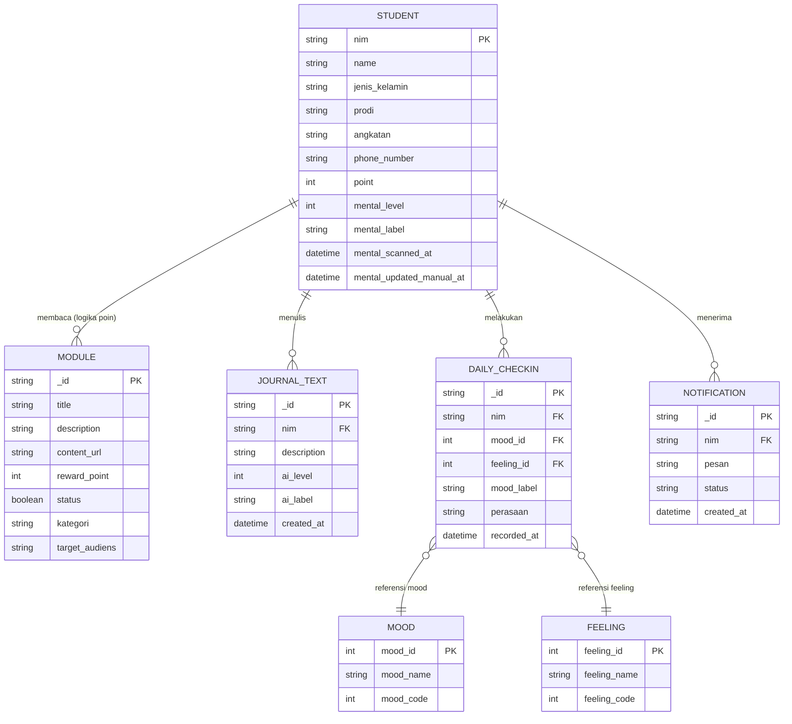
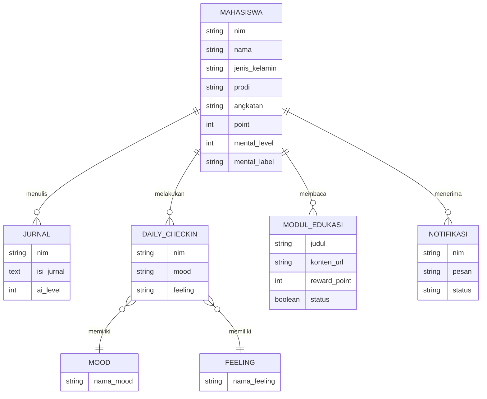
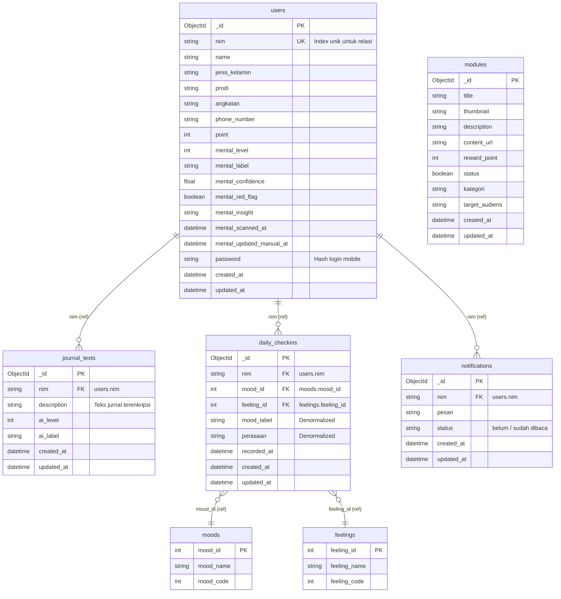

# Diagram Database & Data Model (MongoDB Only)

Dokumen ini berisi dokumentasi diagram database terstruktur untuk **MongoDB** yang digunakan pada proyek Anda (Aplikasi Mobile & AI Scanning). Dokumen ini mencakup Diagram ERD, CDM, dan PDM yang diselaraskan dengan skema database riil.

---

## 1. Diagram ERD (Crow's Foot Notation)

Diagram ERD tingkat logis yang menggambarkan entitas inti sistem dan relasinya khusus untuk MongoDB.

---

## 2. CDM (Conceptual Data Model)

CDM menggambarkan konsep data dan relasi dari sudut pandang bisnis sebelum diimplementasikan secara teknis.

---

## 3. PDM (Physical Data Model)

PDM menggambarkan skema fisik penyimpanan dokumen koleksi MongoDB secara presisi, lengkap dengan tipe data BSON, Primary Key (`PK`), Foreign Key (`FK`), dan unique constraint.

---

## 4. Penjelasan Teknis PDM MongoDB

1. **Autentikasi & Profil (`users`)**:
   Koleksi ini merepresentasikan mahasiswa. Field `nim` diatur sebagai indeks unik (`UK`) karena digunakan sebagai kunci referensi (`FK`) di koleksi lainnya demi portabilitas relasi antara Web (Laravel) dan Mobile (Flutter).
2. **Relasi Mood & Perasaan (`daily_checkins`)**:
   Berbeda dengan database relasional, field `mood_label` dan `perasaan` disimpan langsung secara denormalisasi di dalam koleksi `daily_checkins` agar performa *read* di mobile cepat tanpa memerlukan join. Namun relasi fisik tetap dihubungkan ke tabel lookup `moods` dan `feelings` melalui `mood_id` (Integer) dan `feeling_id` (Integer).
3. **Penyimpanan Jurnal Terenkripsi (`journal_texts`)**:
   Untuk alasan privasi data medis mahasiswa, field `description` disimpan dalam bentuk *ciphertext* terenkripsi (AES-256) menggunakan App Key Laravel Mobile.
4. **Pembersihan Skema Lama**:
   Koleksi redundan `ai_analyses` telah dihapus. Data klasifikasi AI sekarang disimpan langsung pada tingkat dokumen terkait (`users` dan `journal_texts`) demi efisiensi dan keselarasan model.
