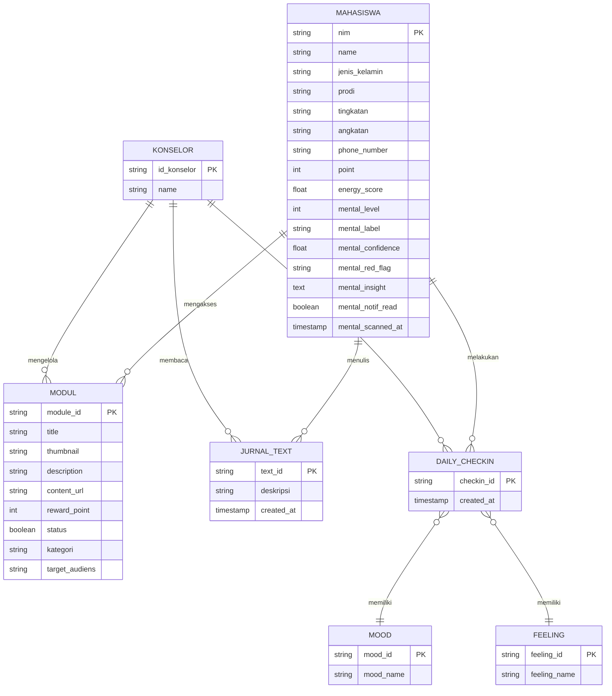
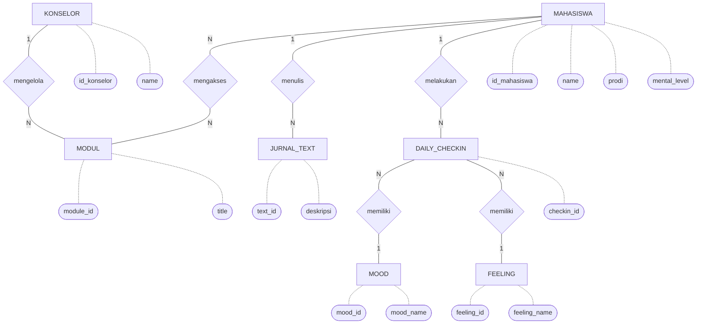
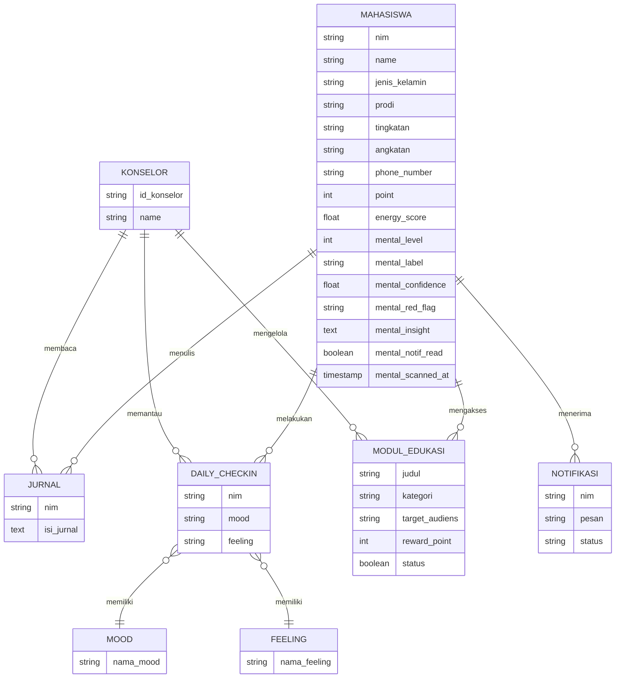
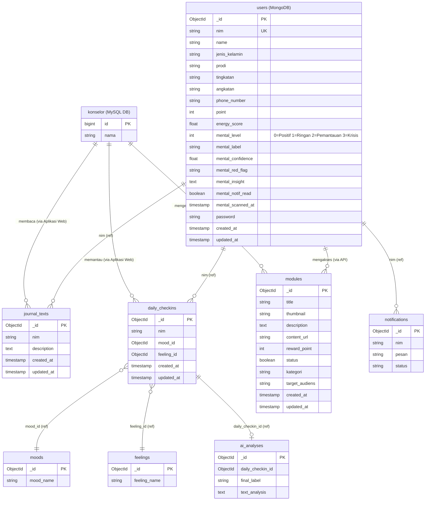

# ERD Konseptual & Data Model (MongoDB)

Dokumen ini berisi empat jenis diagram database dari proyek TA-KEL-12 (Aplikasi Mobile & Interaksi Web) yang dibuat menggunakan Mermaid. 

---

## 1. Diagram ERD (Crow's Foot Notation)

Ini adalah format modern standar (Crow's Foot) yang lebih ringkas dan rapi untuk mendeskripsikan interaksi antara Konselor dan Mahasiswa.

---

## 2. Diagram ERD (Chen Notation - Klasik)

Mermaid tidak memiliki tipe khusus untuk "Chen ERD", namun kita **mengakalinya menggunakan Flowchart Mermaid** dengan bentuk *Diamond* untuk relasi dan *Oval* untuk atribut persis seperti gambar yang Anda buat.

*(Catatan: Atribut dibatasi hanya yang penting-penting saja agar garis tidak terlalu saling menumpuk/kusut saat di-render oleh Mermaid)*

---

## 3. CDM (Conceptual Data Model)

CDM menggambarkan **konsep entitas bisnis dan hubungannya** dari sudut pandang logika bisnis (fokus pada data MongoDB yang tersimpan dari aplikasi Mobile).

---

## 4. PDM (Physical Data Model)

PDM menggambarkan struktur **implementasi teknis koleksi MongoDB** lengkap dengan tipe data, Primary Key, dan skema referensi.

---

## Penjelasan Relasi (Sesuai Konseptual Gambar)

1. **Konselor - Modul (`mengelola`)**
   Konselor memiliki peran sebagai admin yang membuat, mengubah, atau menghapus konten modul edukasi.
2. **Mahasiswa - Modul (`mengakses`)**
   Mahasiswa melihat modul edukasi untuk mendapatkan *reward points*.
3. **Mahasiswa - Jurnal Text (`menulis`)**
   Satu mahasiswa dapat menulis banyak jurnal.
4. **Mahasiswa - Daily Checkin (`melakukan`)**
   Satu mahasiswa dapat melakukan banyak daily checkin.
5. **Daily Checkin - Mood/Feeling (`memiliki`)**
   Setiap satu daily checkin berasosiasi dengan satu Mood dan satu Feeling.
