# Sequence Diagram - Sistem Monitoring Kesehatan Mental Mahasiswa

Dokumen ini berisi kumpulan lengkap sequence diagram yang menggambarkan seluruh alur proses utama dalam sistem (TA-KEL-12).

---

## 1. Login

Alur autentikasi pengguna. Sistem mendukung dua jalur login: lokal (konselor/admin yang sudah tersimpan di database) dan via API kampus (CIS) untuk mahasiswa baru.

**Controller**: [LoginController.php](file:///e:/kuliah/PA3/TA-KEL-12/app/Http/Controllers/LoginController.php)

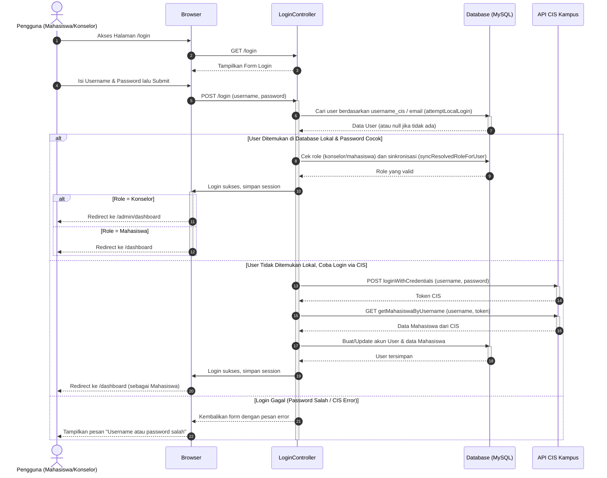

---

## 2. Logout

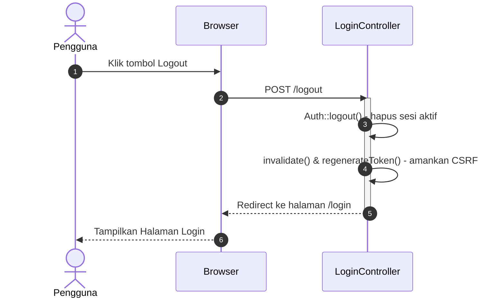

---

## 3. Dashboard Konselor (Halaman Utama)

Alur saat konselor membuka halaman dashboard utama yang menampilkan data statistik mahasiswa, jadwal hari ini, dan chart.

**Controller**: [DashboardController.php](file:///e:/kuliah/PA3/TA-KEL-12/app/Http/Controllers/DashboardController.php) (fungsi `index`) & [AdminController.php](file:///e:/kuliah/PA3/TA-KEL-12/app/Http/Controllers/AdminController.php) (fungsi `dashboard`)

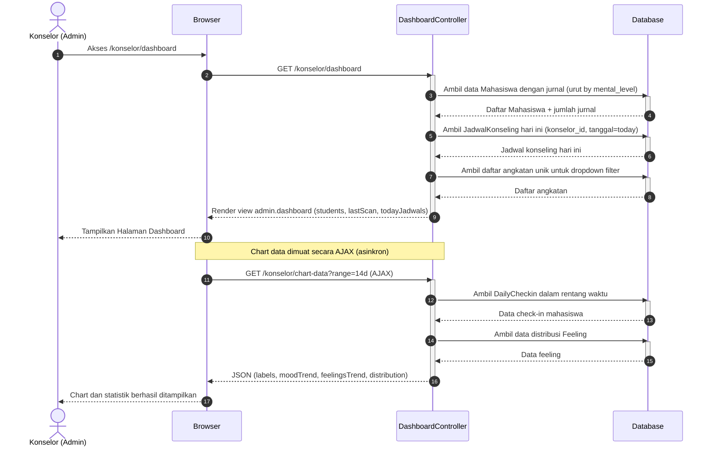

---

## 4. Melihat Detail Mahasiswa (Jurnal & Checkin History)

Alur saat konselor mengklik nama seorang mahasiswa di dashboard untuk melihat riwayat jurnal, mood, dan status mentalnya secara lengkap.

**Controller**: [DashboardController.php](file:///e:/kuliah/PA3/TA-KEL-12/app/Http/Controllers/DashboardController.php) (fungsi `showDetail`)

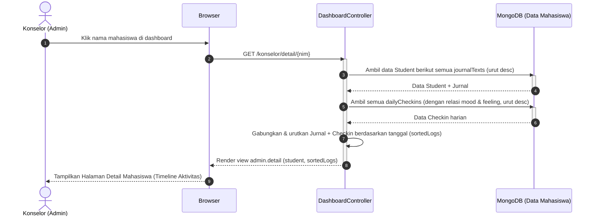

---

## 5. Halaman Semua Mahasiswa (Daftar dengan Filter)

Alur saat konselor membuka halaman daftar semua mahasiswa dan melakukan pencarian/filter berdasarkan prodi, angkatan, atau level mental.

**Controller**: [DashboardController.php](file:///e:/kuliah/PA3/TA-KEL-12/app/Http/Controllers/DashboardController.php) (fungsi `semuaMahasiswa`)

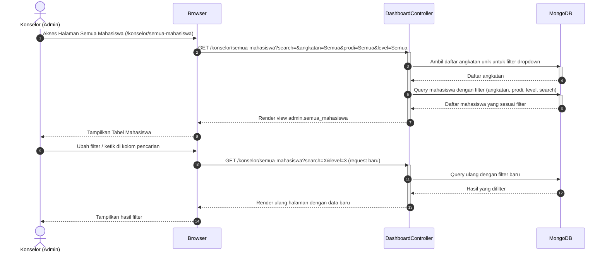

---

## 6. Halaman Mahasiswa Prioritas (Level 3 / Krisis)

Alur saat konselor mengakses halaman khusus yang menampilkan hanya mahasiswa dengan status krisis (Level 3) beserta analisis statistiknya.

**Controller**: [DashboardController.php](file:///e:/kuliah/PA3/TA-KEL-12/app/Http/Controllers/DashboardController.php) (fungsi `prioritas`)

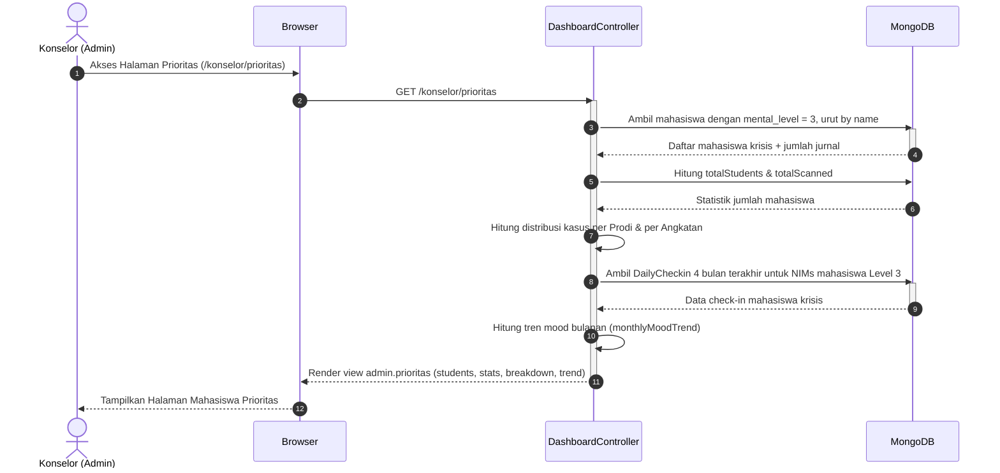

---

## 7. Halaman Laporan Konseling (Daftar & Detail)

Alur saat konselor membuka halaman laporan, melihat daftar mahasiswa yang punya riwayat sesi, dan melihat detail laporan per mahasiswa.

**Controller**: [LaporanController.php](file:///e:/kuliah/PA3/TA-KEL-12/app/Http/Controllers/LaporanController.php)

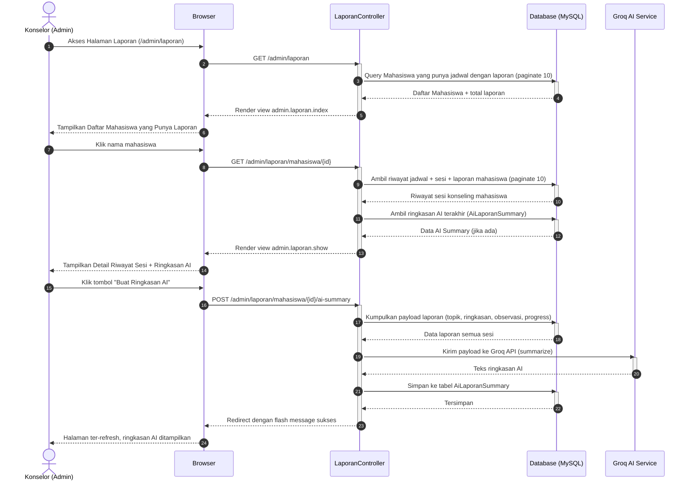

---

## 8. Pengajuan & Persetujuan Jadwal Konseling

Alur lengkap dari Mahasiswa memesan slot hingga Konselor menyetujui atau menolak pengajuan tersebut.

**Controller**: [JadwalController.php](file:///e:/kuliah/PA3/TA-KEL-12/app/Http/Controllers/JadwalController.php) & [AdminController.php](file:///e:/kuliah/PA3/TA-KEL-12/app/Http/Controllers/AdminController.php)

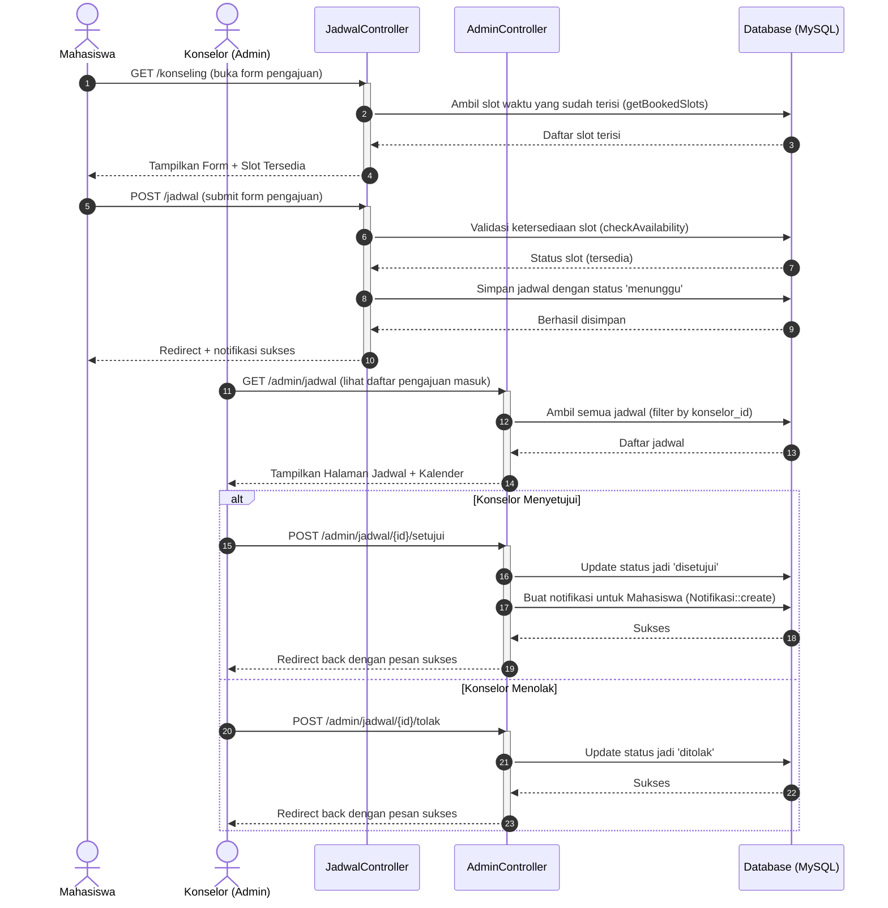

---

## 9. Update Status Mental Mahasiswa Secara Manual

Alur saat konselor mengubah level klasifikasi mental seorang mahasiswa secara manual dari dashboard.

**Controller**: [DashboardController.php](file:///e:/kuliah/PA3/TA-KEL-12/app/Http/Controllers/DashboardController.php) (fungsi `updateStatus`)

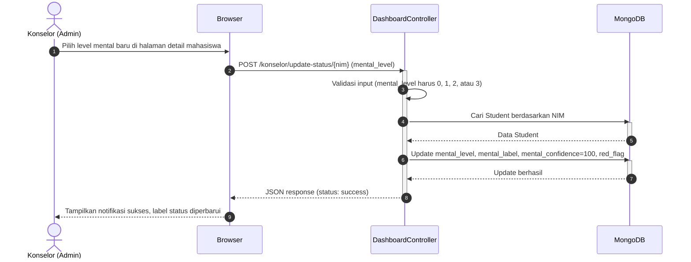

---

## 10. Scan Level 3 (AI Mental Health Detection)

Alur saat konselor memicu pemindaian AI terhadap seluruh mahasiswa untuk mendeteksi level krisis.

**Controller**: [DashboardController.php](file:///e:/kuliah/PA3/TA-KEL-12/app/Http/Controllers/DashboardController.php) (fungsi `scanLevel3`)

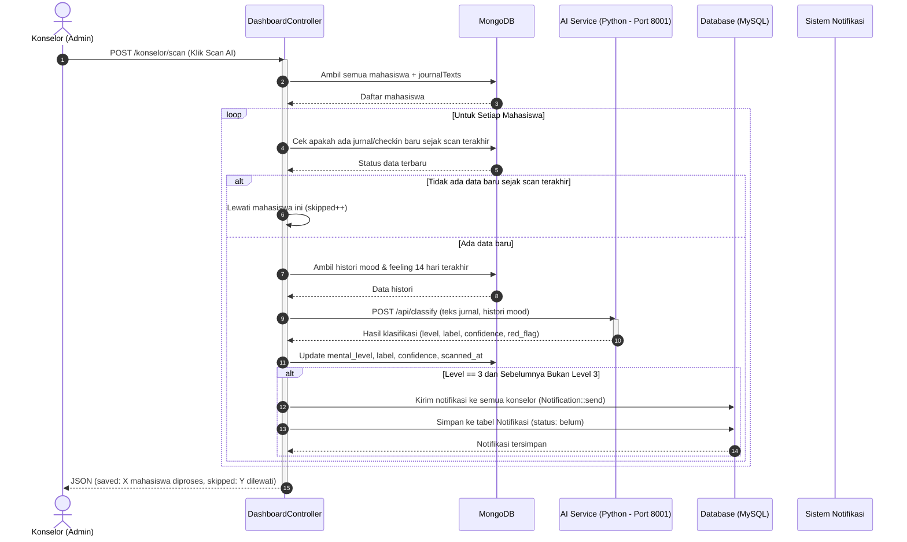

---

## 11. Ringkasan Jurnal Mahasiswa dengan AI

Alur saat konselor meminta AI meringkas seluruh jurnal seorang mahasiswa.

**Controller**: [DashboardController.php](file:///e:/kuliah/PA3/TA-KEL-12/app/Http/Controllers/DashboardController.php) (fungsi `getSummary`)

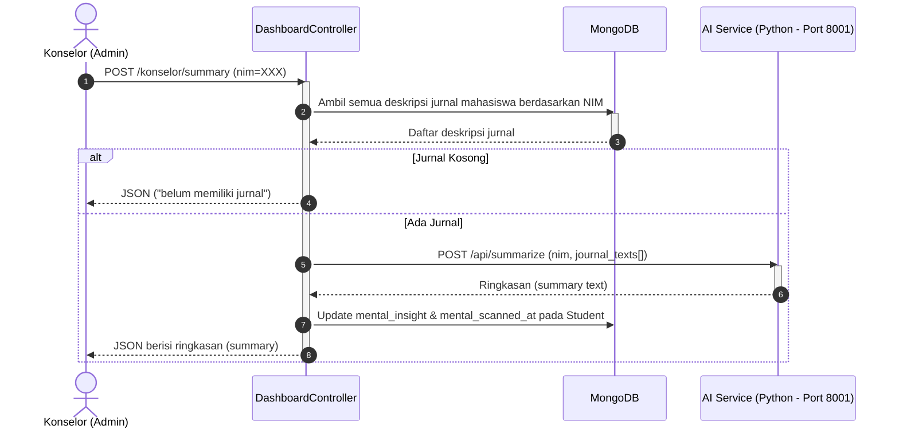

---

## 12. Notifikasi Real-time (Peringatan Mahasiswa Krisis)

Alur pengambilan notifikasi urgensi yang ditampilkan secara real-time di header dashboard konselor.

**Controller**: [DashboardController.php](file:///e:/kuliah/PA3/TA-KEL-12/app/Http/Controllers/DashboardController.php) (fungsi `getUrgentNotifications` & `markUrgentRead`) & [AdminController.php](file:///e:/kuliah/PA3/TA-KEL-12/app/Http/Controllers/AdminController.php) (fungsi `notifications`)

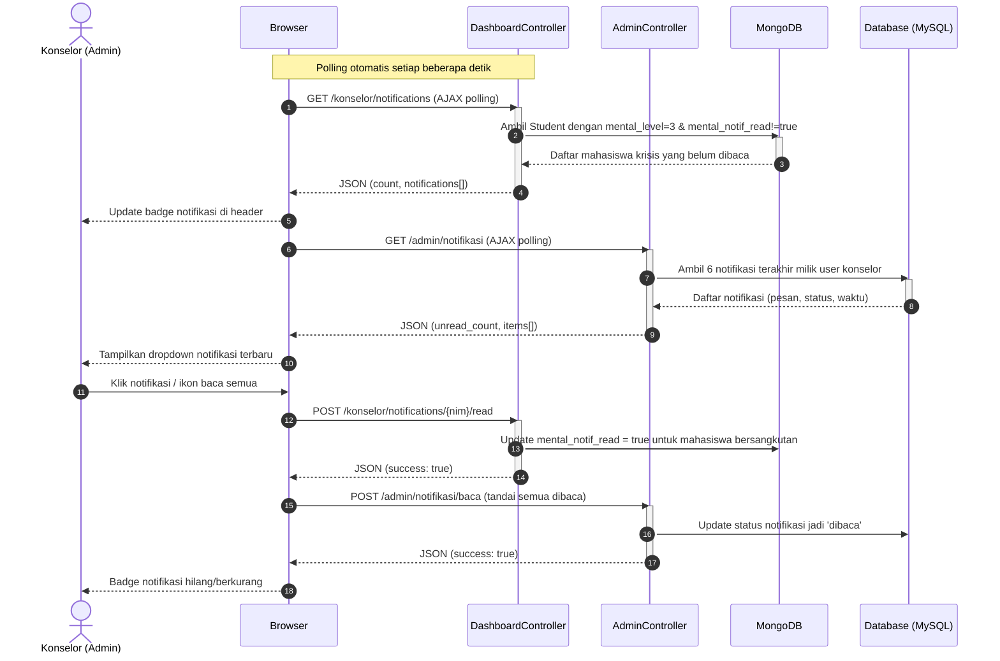

---

## Cara Melihat Diagram di VS Code

1. Buka file ini di VS Code.
2. Tekan **`Ctrl + Shift + V`** untuk membuka Markdown Preview.
3. Atau tekan **`Ctrl + K`** lalu **`V`** untuk membuka preview di samping.
4. Extension Mermaid akan otomatis merender semua blok ` ```mermaid ` menjadi diagram visual.
