# Sitemap - Sistem Monitoring Kesehatan Mental Mahasiswa (TA-KEL-12)

Sitemap ini dibuat berdasarkan `routes/web.php` dan seluruh file view di `resources/views/`.

---

## Sitemap Keseluruhan

```mermaid
flowchart TD
    %% ==========================================
    %% ENTRY POINT
    %% ==========================================
    START([🌐 Akses Website])
    START --> AUTH{Sudah Login?}

    %% ==========================================
    %% HALAMAN PUBLIK
    %% ==========================================
    AUTH -- Belum --> PUB[Halaman Publik]
    PUB --> BERANDA["🏠 Beranda\n/"]
    PUB --> EDU_PUB["📚 Edukasi Mental\n/edukasi-mental"]
    PUB --> KONSELING_PUB["📋 Form Konseling\n/konseling"]
    PUB --> LOGIN["🔐 Login\n/login"]

    %% ==========================================
    %% LOGIN & ROLE CHECK
    %% ==========================================
    LOGIN --> ROLE{Role User?}
    AUTH -- Sudah --> ROLE

    %% ==========================================
    %% MAHASISWA
    %% ==========================================
    ROLE -- Mahasiswa --> MAH[🎓 Area Mahasiswa]

    MAH --> MAH_BERANDA["🏠 Beranda\n/dashboard"]
    MAH --> MAH_PROFIL["👤 Profil\n/profil"]
    MAH --> MAH_RIWAYAT["📄 Riwayat\n/riwayat"]
    MAH --> MAH_JADWAL["📅 Detail Penjadwalan\n/detail-penjadwalan"]
    MAH --> MAH_CHAT["💬 Chat\n/chat"]
    MAH --> MAH_GCHAT["👥 Group Chat\n/group-chat"]

    MAH_RIWAYAT --> MAH_RIWAYAT_DETAIL["📄 Detail Riwayat\n/riwayat/:id"]
    MAH_JADWAL --> MAH_JADWAL_ULANG["📅 Jadwal Ulang\n/konseling/jadwal-ulang/:id"]

    MAH_GCHAT --> MAH_GCHAT_BUAT["➕ Buat Group\n/group-chat/buat"]
    MAH_GCHAT --> MAH_GCHAT_ROOM["💬 Room\n/group-chat/room/:id"]

    %% ==========================================
    %% KONSELOR / ADMIN
    %% ==========================================
    ROLE -- Konselor --> ADM[👨‍⚕️ Area Konselor / Admin]

    %% --- DASHBOARD ---
    ADM --> ADM_DB["📊 Dashboard\n/admin/dashboard\n/konselor/dashboard"]
    ADM_DB --> ADM_DB_PRIORITAS["⚠️ Mahasiswa Prioritas\n/konselor/prioritas"]
    ADM_DB --> ADM_DB_SEMUA["👥 Semua Mahasiswa\n/konselor/semua-mahasiswa"]
    ADM_DB --> ADM_DB_TREN["📈 Laporan Tren\n/konselor/laporan-tren"]
    ADM_DB --> ADM_DB_DETAIL["🔍 Detail Mahasiswa\n/konselor/detail/:nim"]

    %% --- JADWAL ---
    ADM --> ADM_JADWAL["📅 Jadwal\n/admin/jadwal"]

    %% --- SESI ---
    ADM --> ADM_SESI["🗂️ Daftar Sesi\n/admin/sesi"]
    ADM_SESI --> ADM_SESI_DETAIL["🔍 Detail Sesi\n/admin/sesi/:id"]
    ADM_SESI_DETAIL --> ADM_SESI_TOLAK["❌ Tolak Sesi\n/admin/sesi/:id/tolak"]

    %% --- LAPORAN ---
    ADM --> ADM_LAP["📋 Laporan\n/admin/laporan"]
    ADM_LAP --> ADM_LAP_MAH["📋 Laporan Mahasiswa\n/admin/laporan/mahasiswa/:id"]
    ADM_LAP_MAH --> ADM_LAP_BUAT["✏️ Buat Laporan\n/admin/laporan/:id/laporan"]

    %% --- MAHASISWA ---
    ADM --> ADM_MAH["👥 Data Mahasiswa\n/admin/mahasiswa"]

    %% --- NOTIFIKASI ---
    ADM --> ADM_NOTIF["🔔 Notifikasi\n/admin/notifikasi"]

    %% --- CHAT ---
    ADM --> ADM_CHAT["💬 Chat\n/admin/chat"]
    ADM --> ADM_GCHAT["👥 Group Chat\n/admin/group-chat"]

    %% --- EDUKASI ---
    ADM --> ADM_EDU["📚 Edukasi\n/konselor/edukasi"]
    ADM_EDU --> ADM_EDU_MODULES["📦 Modul\n/konselor/edukasi/modules"]
    ADM_EDU --> ADM_EDU_WEBCONTENT["🌐 Konten Web\n/konselor/edukasi/web-contents"]
    ADM_EDU --> ADM_EDU_ABOUT["ℹ️ About Page\n/konselor/edukasi/about-page"]

    ADM_EDU_MODULES --> ADM_EDU_MOD_CREATE["➕ Tambah Modul\n/konselor/edukasi/modules/create"]
    ADM_EDU_MODULES --> ADM_EDU_MOD_EDIT["✏️ Edit Modul\n/konselor/edukasi/modules/:id/edit"]

    ADM_EDU_WEBCONTENT --> ADM_EDU_WEB_CREATE["➕ Tambah Konten\n/konselor/edukasi/web-contents/create"]
    ADM_EDU_WEBCONTENT --> ADM_EDU_WEB_EDIT["✏️ Edit Konten\n/konselor/edukasi/web-contents/:id/edit"]

    %% ==========================================
    %% LOGOUT
    %% ==========================================
    ADM --> LOGOUT["🚪 Logout\nPOST /logout"]
    MAH --> LOGOUT
    LOGOUT --> LOGIN
```

---

## Keterangan Warna / Kelompok Halaman

| Kelompok | Akses | Deskripsi |
|----------|-------|-----------|
| 🌐 **Publik** | Semua orang | Beranda, Edukasi Mental, Form Konseling, Login |
| 🎓 **Mahasiswa** | Role: `mahasiswa` | Dashboard, Profil, Riwayat, Jadwal, Chat, Group Chat |
| 👨‍⚕️ **Konselor/Admin** | Role: `konselor` | Dashboard, Jadwal, Sesi, Laporan, Mahasiswa, Edukasi, Notifikasi, Chat, Group Chat |

## Ringkasan Halaman

| # | Area | Jumlah Halaman |
|---|------|---------------|
| 1 | Publik | 4 |
| 2 | Mahasiswa | 8 |
| 3 | Konselor - Dashboard | 4 |
| 4 | Konselor - Jadwal & Sesi | 4 |
| 5 | Konselor - Laporan | 3 |
| 6 | Konselor - Edukasi | 7 |
| 7 | Konselor - Lainnya (Chat, Mahasiswa, Notifikasi) | 4 |
| **Total** | | **34** |
